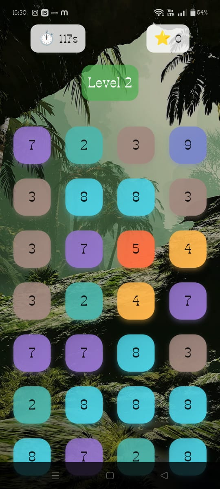

# 🌿 Jungle Number Puzzle Game 🧩

A Flutter puzzle game inspired by **Number Master by KiwiFun**, redesigned with a **jungle-themed UI**, **colorful animated bubbles**, **level-based progression**, and **Riverpod state management**. The player must match numbers that are either the same or add up to 10 within 2 minutes per level.

---

## 🧠 Game Rules

- Tap **two numbers** that are:
  - **Identical** (e.g. 3 + 3)
  - **Sum up to 10** (e.g. 6 + 4)
- Matches remove the numbers and score points.
- Clear all the bubbles before time runs out to win the level.
- Game has **3 levels**, increasing in complexity.
- If time runs out or no match is left → Retry screen shown.
- Win → Pass screen with stars and animated celebration!

---

## ✨ Features

- 🌴 **Jungle-themed home screen**
- 🎨 **Colorful animated bubbles**
- 💥 **Visual feedback on match & selection**
- ⏱️ **2-minute countdown timer**
- ⭐ **Score & star rating system**
- 🔄 **Retry & Pass result screens**
- 📦 **Riverpod** for reactive state management
- 🧱 Clean, modular architecture
- 🎮 Works offline and on all screen sizes

---

## 📸 Screenshots
    


## Getting Started

Follow these instructions to get a copy of the project up and running on your local machine.

### Prerequisites

- Flutter installed on your machine ([Installation Guide](https://flutter.dev/docs/get-started/install))
- Emulator or physical device for testing

### Installation

1. Clone the repository:

   ```bash
   git clone https://github.com/zahra-choksi/puzzle_game.git
2. Change into the project directory:

   ```bash
    cd puzzle_game
3. Install dependencies:

    ```bash
    flutter pub get
4. Run the app:

    ```bash
   flutter run


## 📲 Download APK

You can download and try the game:

➡️ [**Download APK**](build/app/outputs/flutter-apk/app-release.apk)

   
    

